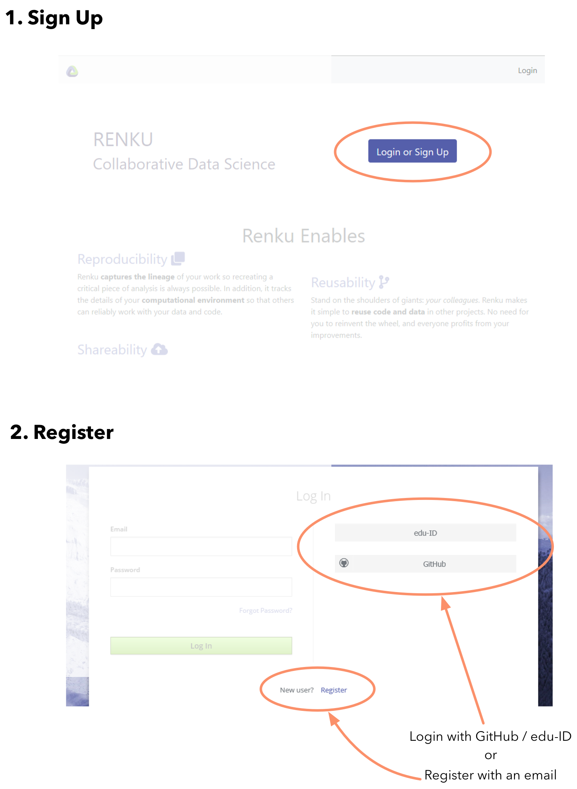
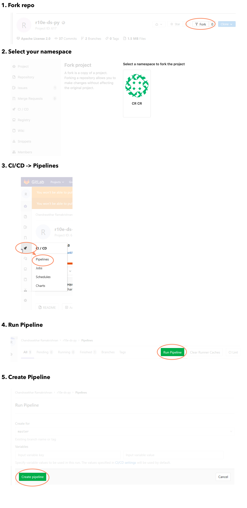
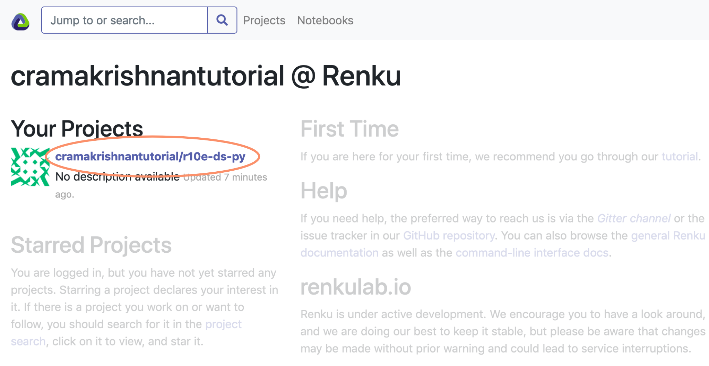
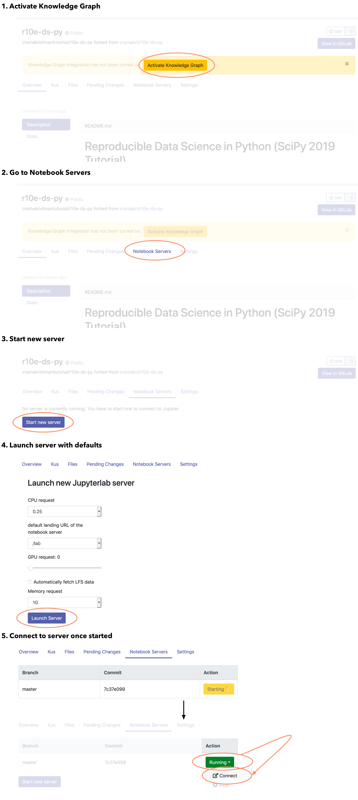

# Set up tutorial on Renkulab

If you do not with to set up an environment on your computer, you can use Renkulab.

## Sign up

First, connect to https://renkulab.io

Then follow these sign up instructions:

## Fork the main repo

Then, go to the r10e-ds-py repo: https://renkulab.io/gitlab/cramakri/r10e-ds-py and fork it following these instructions:

## Naviate to your project

Connect back to https://renkulab.io/. You should see the r10e-ds-py as one of your projects. Click on that link.

## Start a server

